# StreamWeave 真实 Trace Demo

这个 demo 展示两件事：

1. 图文交错 memory 如何在真实评测 trace 中保存历史证据。
2. 和纯文本 memory 相比，它是否真的省 token，同时是否还能保持正确率。

每个 case 都按同一个结构展示：

1. **Question**：评测问题。
2. **Result and Cost**：图文交错和纯文本的答案、得分、final memory token。
3. **Evidence window**：答案证据出现的 5 帧。
4. **Answer-time window**：回答问题时模型看到的当前 5 帧；如果视频末尾不足 5 帧，则展示回答时刻附近的 5 帧。
5. **Interleaved memory before answering**：图文交错 memory 里和答案相关的片段。
6. **Text-only memory before answering**：纯文本 memory 里对应片段。
7. **Outputs**：两种方法的真实输出摘要。

`<delta>` 是模型写出的文本事件变化；`<anchor>` 是模型保留下来的真实视频帧。后续 step 的 prompt 会把这些 `<delta>` 文本和 `<anchor>` 图片交错喂回模型。

## Sources

| 项目 | 路径 |
|---|---|
| 图文交错 full 结果 | `outputs/gemini_full_0516/results.jsonl` |
| 图文交错 full trace | `outputs/gemini_full_0516/traces/` |
| 纯文本 full 结果 | `outputs/streamtext/ovo_gemini_flash_full/results.jsonl` |
| 纯文本 full trace | `outputs/streamtext/ovo_gemini_flash_full/traces/` |
| qualitative SFT trace 参考 | `outputs/ovo_qwen3vl_sft_0516_step50_1of8/traces/` |

下面的 paired token 统计来自 Gemini full。图片 token 用 Qwen3-VL-equivalent visual tokens 估算：后端实际将图片最长边缩到 448，并保持宽高比。

---

## Token Efficiency

统一计量方式：

```text
C_memory = C_text + C_image
C_text   = Qwen3-VL tokenizer(memory text)
C_image  = sum_i ceil(W_i / 32) * ceil(H_i / 32)
```

其中 `W_i, H_i` 是图片经过实际后端 resize 后的尺寸。`resolution: 448` 不是 `448x448`，而是最长边 448。例如常见 `1280x720` 帧会变成约 `448x252`，对应约 `14 * 8 = 112` 个视觉 token。

在两边都有 memory 的 `3034` 个 OVO 样本上做 paired comparison：

| Method | Text tokens | Image tokens | Total memory tokens | Micro Acc. | Official OVO AVG |
|---|---:|---:|---:|---:|---:|
| Interleaved Memory | 4.27M | 3.21M | **7.48M** | **58.70%** | 61.86% |
| Text-only Memory | 18.45M | 0 | **18.45M** | 58.04% | **62.22%** |

最终 memory token reduction：

```text
1 - 7.48M / 18.45M = 59.5%
bootstrap 95% CI: [57.7%, 61.1%]
```

逐样本比较：

| Metric | Value |
|---|---:|
| Interleaved token 更少的样本比例 | 74.03% |
| Interleaved correct, text-only wrong | 381 |
| Text-only correct, interleaved wrong | 361 |
| Both correct | 1400 |
| Both wrong | 892 |

稳妥结论：

```text
Interleaved memory reduces final memory tokens by 59.5% while maintaining comparable accuracy.
It also produces slightly more paired wins than text-only memory: 381 vs. 361.
```

按任务拆开，图文交错在需要视觉证据保真的任务上更占优：

| Task | Interleaved Acc. | Text-only Acc. | Interleaved-only wins | Text-only-only wins | Token reduction |
|---|---:|---:|---:|---:|---:|
| CRR | 51.25% | 28.33% | 68 | 13 | 69.8% |
| STU | 66.29% | 62.36% | 32 | 25 | 67.6% |
| ACR | 89.91% | 84.40% | 8 | 2 | 46.1% |
| ATR | 72.41% | 70.69% | 11 | 9 | 70.5% |
| REC | 34.24% | 32.66% | 95 | 84 | 29.3% |
| SSR | 67.09% | 65.18% | 85 | 73 | 26.2% |

Additional backward paired wins:

| sample | Task | GT | Interleaved | Text-only | Interleaved tokens | Text-only tokens | Saving |
|---|---|---:|---|---|---:|---:|---:|
| `325` | HLD | B | B | A | 6,449 | 38,175 | 83.1% |
| `327` | HLD | A | A | B | 8,476 | 32,094 | 73.6% |
| `110` | EPM | B | B | C | 4,959 | 14,260 | 65.2% |
| `132` | EPM | A | A | C | 3,735 | 8,600 | 56.6% |
| `577` | ASI | B | B | C | 5,201 | 12,241 | 57.5% |
| `199` | EPM | C | C | cannot answer | 1,113 | 2,688 | 58.6% |

---

## Case 1: `636`, STU, direction judgment

### Question

```text
Which direction am I moving?
Options:
A. Move forward while moving up
B. Move forward while moving down
C. Move backward while moving up
D. Move backward while moving down
```

### Result and Cost

| Method | Answer | Score | Memory tokens |
|---|---|---:|---:|
| Interleaved Memory | B | 1 | 12,333 |
| Text-only Memory | A | 0 | 93,720 |

Token saving:

```text
1 - 12,333 / 93,720 = 86.8%
```

### Evidence window

For this realtime question, the evidence window is the answer-time window itself.

| 1475s | 1476s | 1477s | 1478s | 1479s |
|---|---|---|---|---|
| 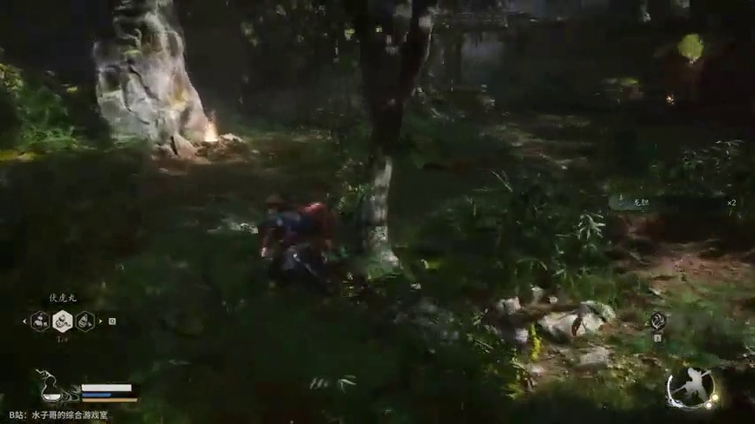 | 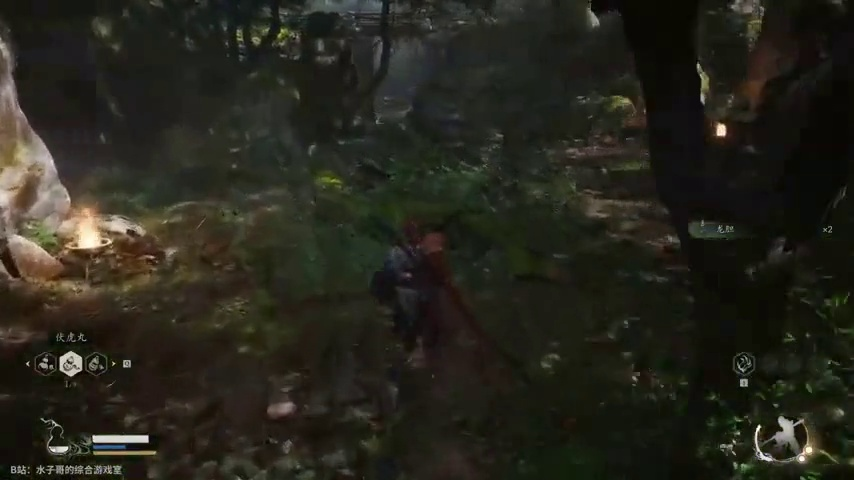 | 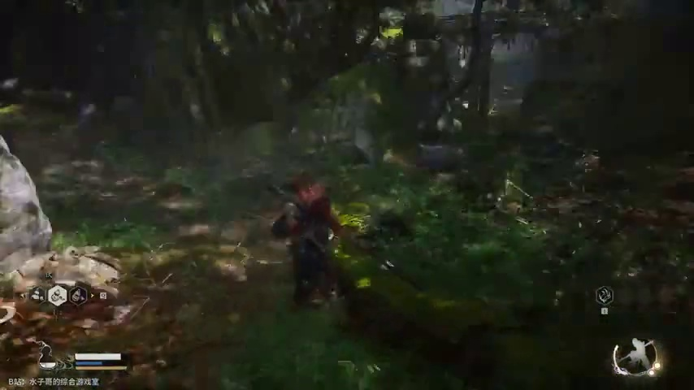 | 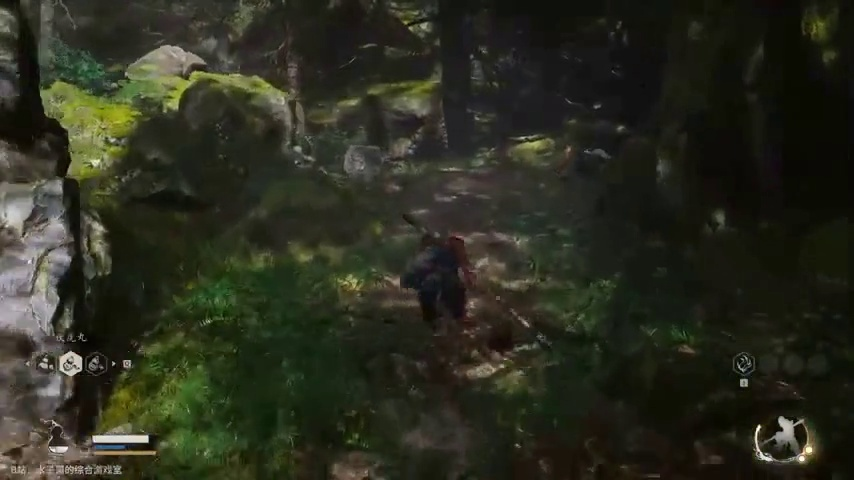 | 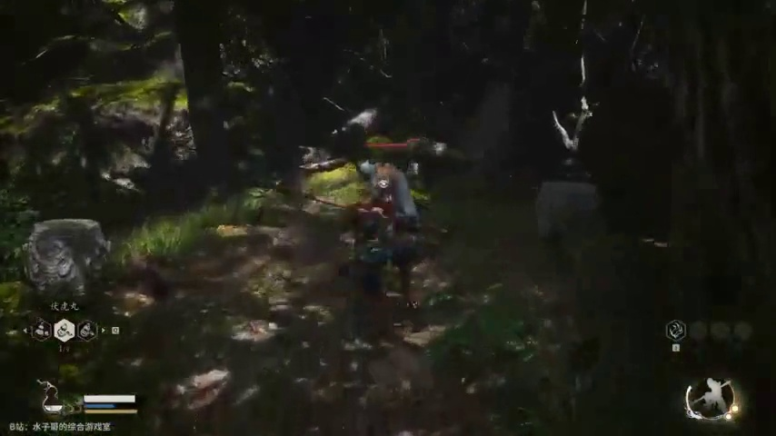 |

### Answer-time window

| 1475s | 1476s | 1477s | 1478s | 1479s |
|---|---|---|---|---|
|  |  |  |  |  |

### Interleaved memory before answering

```xml
<delta>...the character has been moving forward through the forest path...</delta>
<anchor><image:dataset/ovo/video/636/...></anchor>
...
<current frames>1475s-1479s</current frames>
```

The interleaved prompt contains current visual frames plus sparse visual anchors from the trajectory.

### Text-only memory before answering

```text
The character is moving forward through a forested area...
The terrain is described in text, without visual anchors for rechecking slope and camera motion.
```

### Outputs

Interleaved:

```xml
<state>
The character has been consistently moving forward along a path.
The current frames show the character continuing to run forward on a path
that appears to be relatively flat or slightly downhill.
</state>
<answer>B</answer>
```

Text-only:

```xml
<state>
The character is running up a slight incline, indicating movement forward and upward.
</state>
<answer>A</answer>
```

### Takeaway

纯文本 memory 很长，但坡度方向被文字化后误导了最终判断。图文交错保留视觉证据，用少很多 token 答对。

---

## Case 2: `1474_2`, CRR, where the pair goes next

### Question

```text
The two people, one man and one woman, are talking.
Where they go and stay for a while next?
Decide whether the existing visual content provides enough information.
Answer only with "Yes" or "No".
```

### Result and Cost

| Method | Answer | Score | Memory tokens |
|---|---|---:|---:|
| Interleaved Memory | Yes | 1 | 10,107 |
| Text-only Memory | No | 0 | 76,826 |

Token saving:

```text
1 - 10,107 / 76,826 = 86.8%
```

### Evidence window

The final step has only two current frames in the prompt, so this table shows the 5-frame answer-time neighborhood.

| 1752s | 1753s | 1754s | 1755s | 1756s |
|---|---|---|---|---|
| 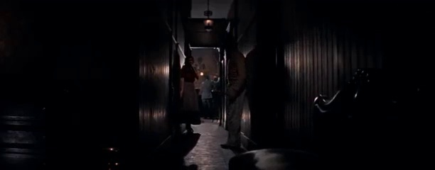 |  | 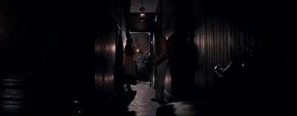 |  | 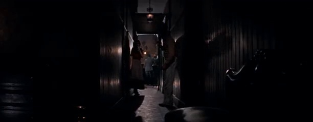 |

### Answer-time window

| 1752s | 1753s | 1754s | 1755s | 1756s |
|---|---|---|---|---|
|  |  |  |  |  |

### Interleaved memory before answering

```xml
<delta>...a young man and a woman are talking at a bar...</delta>
<delta>...the man follows the woman down a dark hallway...</delta>
<anchor><image:dataset/ovo/video/1474_2/001755.jpg></anchor>
```

### Text-only memory before answering

```text
The current frames show a dim hallway with two figures walking away...
The text-only memory does not preserve enough visual transition evidence to decide the destination.
```

### Outputs

Interleaved:

```xml
<state>
The video shows a young man and a woman talking at a bar.
The man follows the woman down a dark hallway.
Based on the current frames, they are walking down a dark hallway together.
</state>
<answer>Yes</answer>
```

Text-only:

```xml
<state>
The current frames continue to show a dimly lit hallway...
the question cannot be answered from the current visual information.
</state>
<answer>No</answer>
```

### Takeaway

这个 CRR 例子展示的是“证据已经出现了吗”。图文交错用更少 token 保留关键转场，纯文本判断证据不足。

---

## Case 3: `199`, EPM, early bedroom object

### Question

```text
What is the gold object on the nightstand?
Options:
A. A painting
B. A mirror
C. A nightlamp
D. A vase
```

### Result and Cost

| Method | Answer | Score | Memory tokens |
|---|---|---:|---:|
| Interleaved Memory | C | 1 | 1,113 |
| Text-only Memory | cannot answer | 0 | 2,688 |

Token saving:

```text
1 - 1,113 / 2,688 = 58.6%
```

### Evidence window

The answer appears in the early bedroom view.

| 42s | 43s | 44s | 45s | 46s |
|---|---|---|---|---|
|  |  | 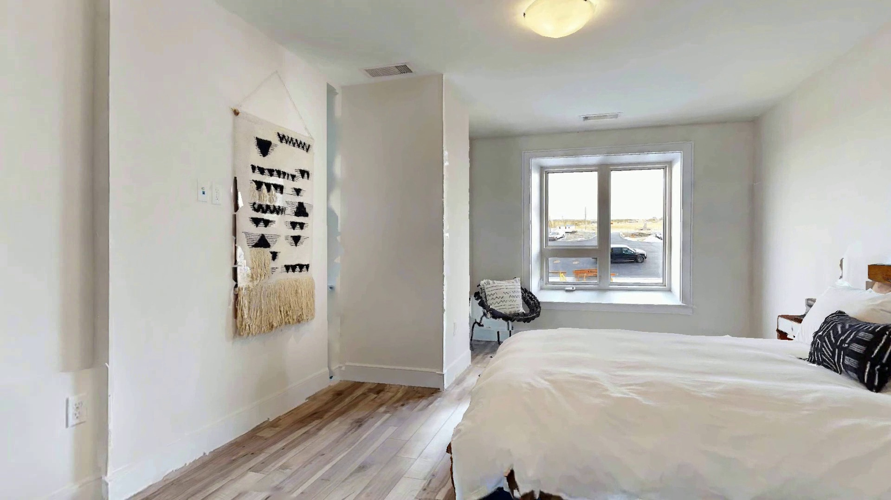 |  |  |

### Answer-time window

The question is asked much later, when the current frames show the kitchen/dining area.

| 105s | 106s | 107s | 108s | 109s |
|---|---|---|---|---|
| 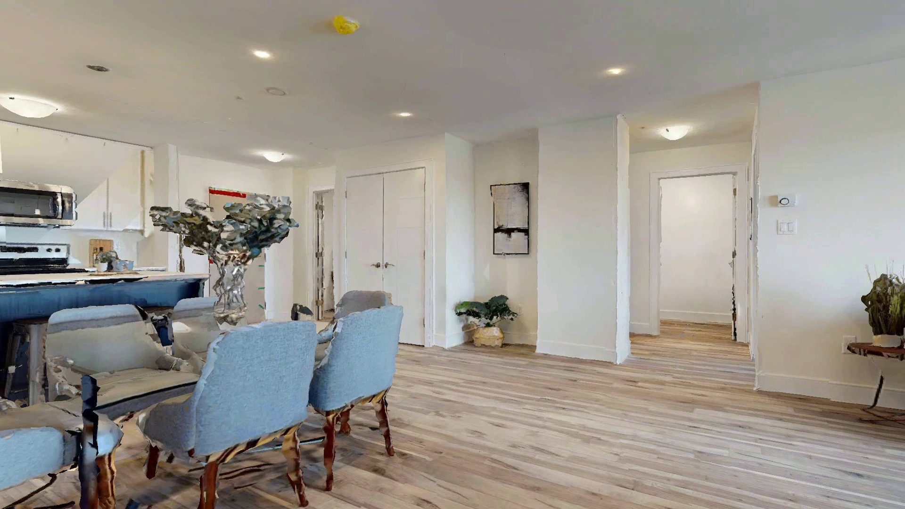 |  | 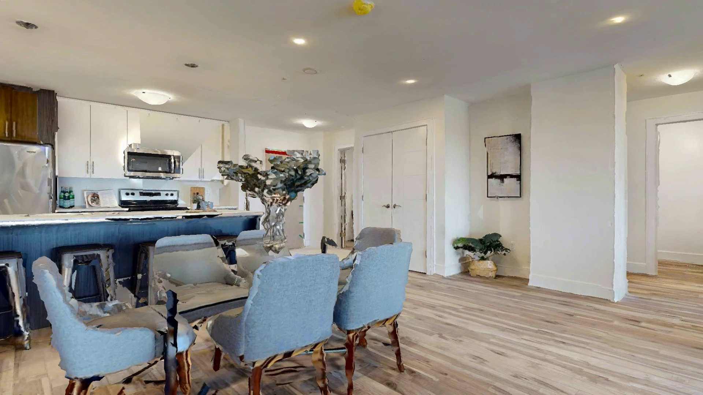 |  |  |

### Interleaved memory before answering

```xml
<delta t="29.0-42.0">
The camera pans right, focusing again on the bedroom visible through the doorway,
then moves forward into the bedroom and begins to pan left.
</delta>
<anchor t="42.0-43.0">
  <image:dataset/ovo/video/199/000042.jpg>
</anchor>
<delta t="43.0-65.0">
The camera continues to pan left, showing a wall with a tapestry hanging on it,
and then moves out of the bedroom through the doorway.
</delta>
```

### Text-only memory before answering

```text
40.0-45.0:
The bedroom features light wooden flooring, a bed with white bedding and dark pillows,
and a large window. A black chair with a white pillow is visible near the window...

55.0-60.0:
The bedroom becomes increasingly visible. The bed with white bedding and the window
are becoming more visible...
```

### Outputs

Interleaved:

```xml
<state>
The nightstand was visible in the bedroom from t=42.0 to t=65.0.
Reviewing the memory from that time, specifically the anchor at t=42.0-43.0,
shows a nightstand next to the bed. On the nightstand, there is a white object
with a gold-colored base, which appears to be a nightlamp.
</state>
<answer>C</answer>
```

Text-only:

```xml
<state>
The video shows a dining area and kitchen...
There is no nightstand or gold object visible in the current frames or in the
previously described bedroom.
</state>
<answer>The question cannot be answered from the provided video frames.</answer>
```

### Takeaway

这个 backward case 不是最后 5 帧问题。最后 5 帧两边看到的都是 kitchen/dining，差异在于图文交错能回看早期 bedroom anchor。

---

## Case 4: `1512_2`, CRR, blue box becomes answerable

### Question

```text
The man is holding a blue box in his hand, what's in the blue box?
Decide whether the existing visual content provides enough information.
Answer only with "Yes" or "No".
```

### Result and Cost

| Method | Answer | Score | Memory tokens |
|---|---|---:|---:|
| Interleaved Memory | Yes | 1 | 9,717 |
| Text-only Memory | A silver locket and chain. | 0 | 48,300 |

Token saving:

```text
1 - 9,717 / 48,300 = 79.9%
```

### Evidence window

The box is opened around 1252s-1256s.

| 1252s | 1253s | 1254s | 1255s | 1256s |
|---|---|---|---|---|
| 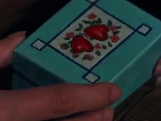 | 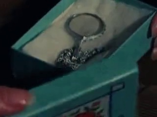 | 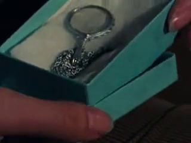 | 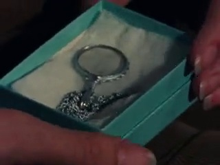 | 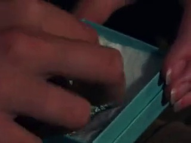 |

### Answer-time window

| 1255s | 1256s | 1257s | 1258s | 1259s |
|---|---|---|---|---|
|  |  | 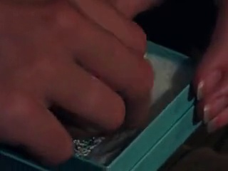 | 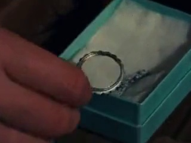 | 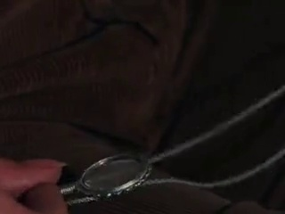 |

### Interleaved memory before answering

```xml
<delta t="1237.0-1249.0">...the blue box is shown.</delta>
<anchor t="1249.0-1250.0"><image:dataset/ovo/video/1512_2/001249.jpg></anchor>
<delta t="1250.0-1253.0">
The man continues to hold the blue box... at 1252s the box is opened to reveal a keychain.
</delta>
<anchor t="1253.0-1254.0"><image:dataset/ovo/video/1512_2/001253.jpg></anchor>
```

### Text-only memory before answering

```text
1250.0-1255.0:
The box is open, revealing a silver locket and chain nestled inside...
```

### Outputs

Interleaved:

```xml
<state>
The previous answer was "No" because the box was closed.
The woman has now opened the box, revealing the contents.
The current frames show the contents of the box.
</state>
<answer>Yes</answer>
```

Text-only:

```xml
<state>
The previous delta already described the contents as a silver locket and chain.
The current frames show a close-up of the locket and chain being held...
</state>
<answer>A silver locket and chain.</answer>
```

### Takeaway

这个样本的评分要求是只答 `Yes/No`。图文交错不仅保留了盒子打开的视觉证据，也遵守了问题格式；纯文本给出了内容描述，格式上错了。

---

## Case 5: `580`, ASI, recipe step chain

### Question

```text
What does the person do after now add the rolls into the hot oil and cook for 6-8 minutes until they are light golden brown?
Options:
A. put the mixture on edge roll ...
B. once it is done remove from the microwave ...
C. once the rolls turn brown remove and place them on a plate with paper towels and serve
D. broccoli slaw in a bowl add ...
```

### Result and Cost

| Method | Answer | Score | Memory tokens |
|---|---|---:|---:|
| Interleaved Memory | C | 1 | 4,369 |
| Text-only Memory | C | 1 | 13,126 |

Token saving:

```text
1 - 4,369 / 13,126 = 66.7%
```

This case is kept as a qualitative recipe-chain example. Both methods answer correctly, but their memory representations differ.

### Evidence window

The relevant step chain reaches the completed rolls and the wok.

| 453s | 454s | 455s | 456s | 457s |
|---|---|---|---|---|
| 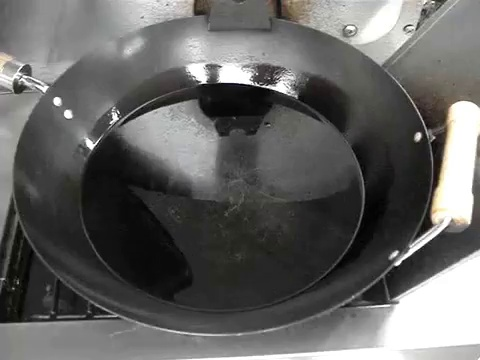 | 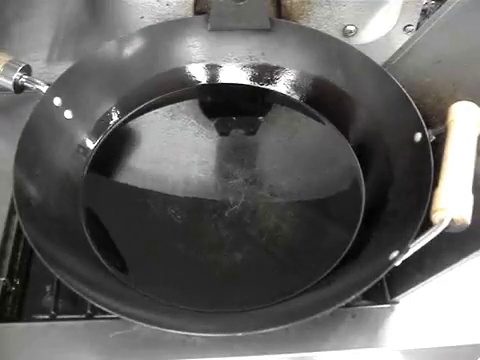 | 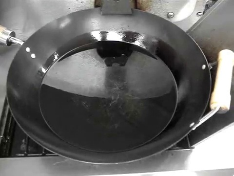 | 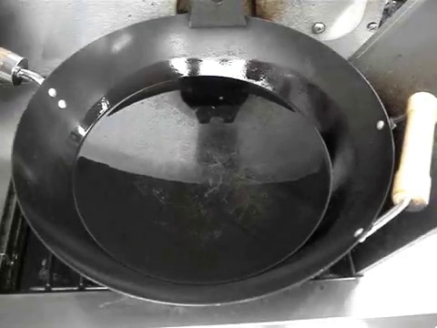 | 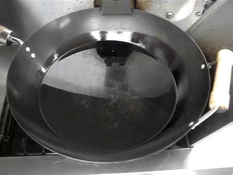 |

### Answer-time window

The final step has three current frames in the prompt, so this table shows the 5-frame answer-time neighborhood.

| 453s | 454s | 455s | 456s | 457s |
|---|---|---|---|---|
|  |  |  |  |  |

### Interleaved memory before answering

```xml
<delta>...prepare the filling...</delta>
<delta>...make a sealer with cornstarch and water...</delta>
<delta>...place spring roll wrappers on a plate and begin filling...</delta>
<delta>...fold and roll the wrapper around the filling...</delta>
<anchor t="446.0-447.0"><image:tray of spring rolls></anchor>
<delta t="447.0-453.0">The tray of spring rolls remains on screen, then the scene transitions to a wok.</delta>
<anchor t="453.0-454.0"><image:wok></anchor>
```

### Text-only memory before answering

```text
445.0-450.0:
The scene transitions to a dark baking sheet filled with several completed spring rolls...

450.0-455.0:
The scene transitions to a black wok with oil on a stovetop. The oil appears to be heating up...
```

### Outputs

Interleaved:

```xml
<state>
The video has shown the complete process of preparing the filling, wrapping the rolls,
and placing them on a baking sheet. The current frames show a wok with oil heating.
</state>
<answer>C</answer>
```

Text-only:

```xml
<state>
The video shows a black wok with oil heating up. The question asks about the next step
after cooking the spring rolls.
</state>
<answer>C</answer>
```

### Takeaway

这是一个步骤链 case。两边都能答对，但图文交错把长菜谱压成少量步骤 delta 和关键 visual anchors，更适合展示 memory 结构。

---

## Case 6: `1603_8`, REC, pole vault counting

### Question

```text
How many times did they pole vault?
Provide your answer as a single number.
```

### Result and Cost

| Method | Answer | Score | Memory tokens |
|---|---|---:|---:|
| Interleaved Memory | 4 | 1 | 2,222 |
| Text-only Memory | 4 | 1 | 2,437 |

Token saving:

```text
1 - 2,222 / 2,437 = 8.8%
```

### Evidence window

One of the counted vaults appears around 83s-87s.

| 83s | 84s | 85s | 86s | 87s |
|---|---|---|---|---|
| 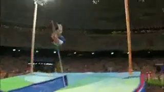 | 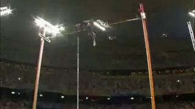 | 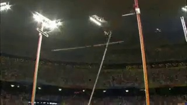 | 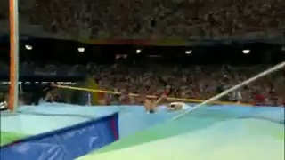 | 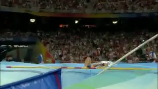 |

### Answer-time window

The final answer is produced near the end of the clip.

| 87s | 88s | 89s | 90s | 91s |
|---|---|---|---|---|
|  |  | 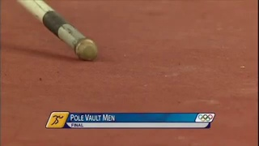 | 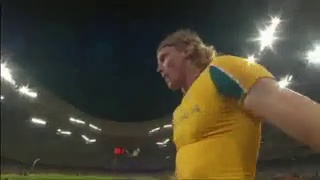 | 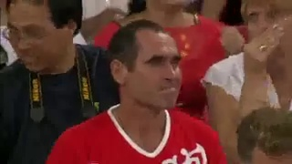 |

### Interleaved memory before answering

```xml
<delta>...first athlete starts running and vaults...</delta>
<anchor><image:dataset/ovo/video/1603_8/000015.jpg></anchor>
<delta>...Evgeny Lukyanenko vaults...</delta>
<anchor><image:dataset/ovo/video/1603_8/000083.jpg></anchor>
```

### Text-only memory before answering

```text
55.0-60.0:
Steve Hooker begins his run-up for a pole vault attempt.

60.0-65.0:
Steve Hooker completes his pole vault attempt...

75.0-80.0:
Another athlete begins his run-up for a pole vault attempt...
```

### Outputs

Interleaved:

```xml
<state>
The video shows a pole vault competition. Based on my memory,
there have been four pole vaults performed.
</state>
<answer>4</answer>
```

Text-only:

```xml
<state>
The current frames show a male athlete performing a pole vault...
</state>
<answer>4</answer>
```

### Takeaway

这是累计计数 case。图文交错 memory 用 anchor 保留关键动作状态，delta 负责累计事件链。

---

## Case 7: `252`, EPM, second-floor bathroom

### Question

```text
Where can I wash my hands on the second story of the house?
Options:
A. The bathroom sink
B. The table in the dining room
C. The shelf in the hallway
D. The shelf in the closet
```

### Result and Cost

| Method | Answer | Score | Memory tokens |
|---|---|---:|---:|
| Interleaved Memory | A | 1 | 477 |
| Text-only Memory | A | 1 | 5,970 |

Token saving:

```text
1 - 477 / 5,970 = 92.0%
```

### Evidence window

The bathroom vanity and sink appear earlier on the second floor.

| 38s | 39s | 40s | 41s | 42s |
|---|---|---|---|---|
| 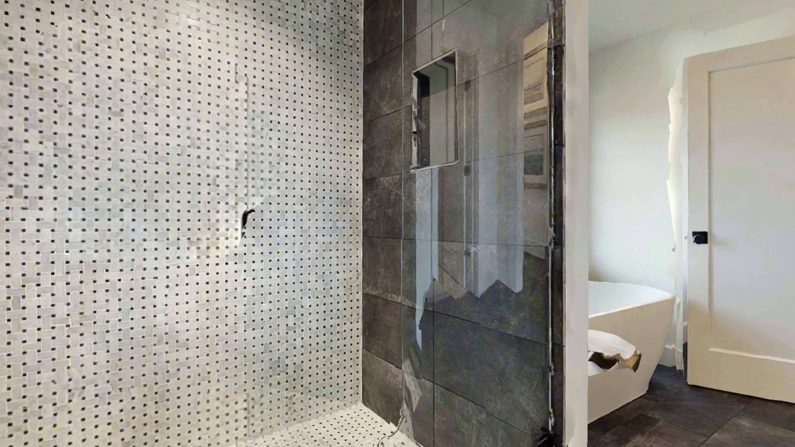 | 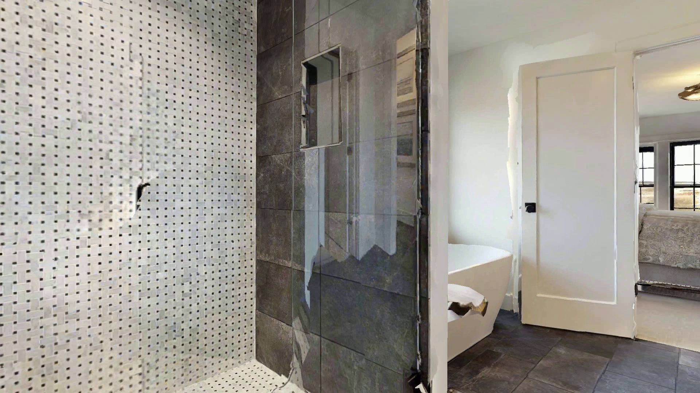 |  |  |  |

### Answer-time window

The question is answered later, when the camera is no longer in the second-floor bathroom.

| 229s | 230s | 231s | 232s | 233s |
|---|---|---|---|---|
| 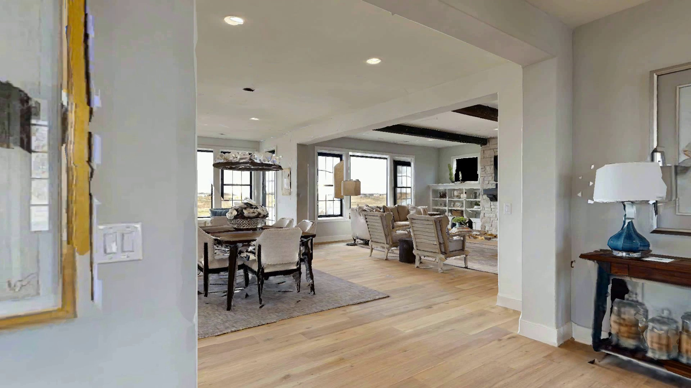 | 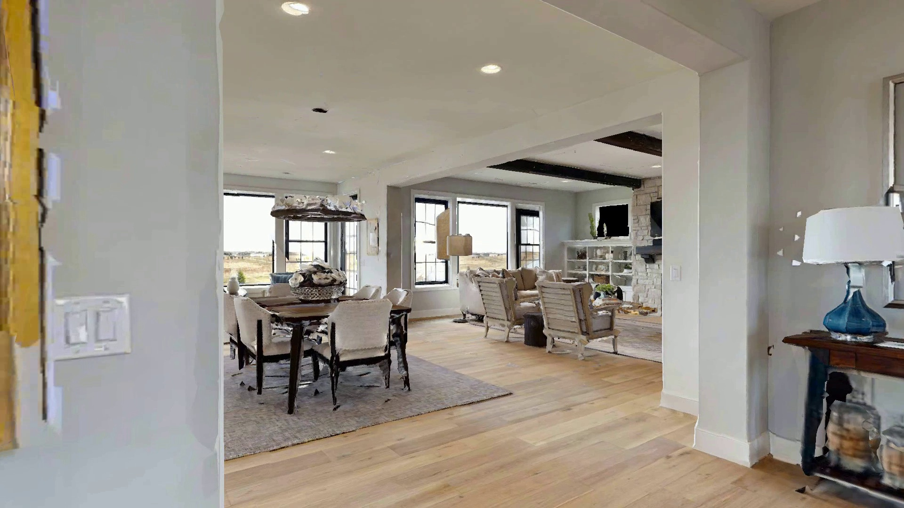 | 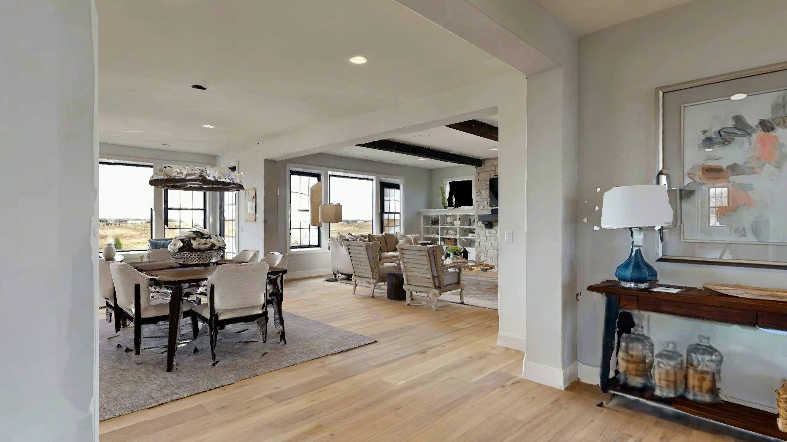 | 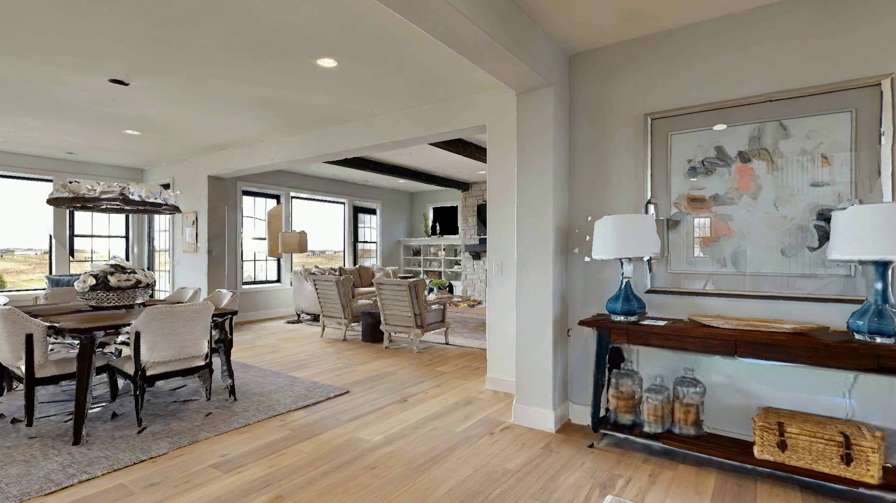 | 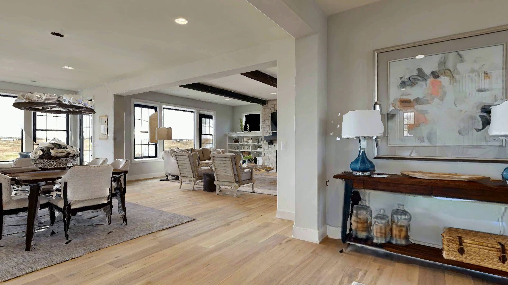 |

### Interleaved memory before answering

```xml
<delta t="1.0-37.0">...revealing a hallway and a bathroom on the right side...</delta>
<delta t="38.0-89.0">
The camera continues to pan left, revealing more of the bathtub and the room beyond it,
then at 42s, a vanity and mirror become visible...
</delta>
```

### Text-only memory before answering

```text
50.0-55.0:
On the right side of the frame, the light-colored vanity with a sink, faucet, and mirror is prominent.

55.0-60.0:
The light-colored vanity with a sink, faucet, and mirror is now more prominent...
```

### Outputs

Interleaved:

```xml
<state>
The video toured a walk-in closet, a bathroom, a bedroom, and a hallway on the second floor.
The question asks where one can wash hands on the second story.
Based on memory, a bathroom with a vanity and sink was shown on the second floor.
</state>
<answer>A</answer>
```

Text-only:

```xml
<answer>A</answer>
```

### Takeaway

这个 backward case 两边都答对；它展示了图文交错 memory 和纯文本 memory 对早期空间信息的两种保存方式。

---

## Case 8: `1143`, FPD, drawer action

### Question

```text
What is this person doing with the drawer?
Options:
A. testing the drawer's mechanisms
B. opening the drawer to retrieve or place an item inside
C. cleaning out the drawer
D. inspecting the contents
```

### Result and Cost

| Method | Answer | Score | Memory tokens |
|---|---|---:|---:|
| Interleaved Memory | B | 1 | 750 |
| Text-only Memory | B | 1 | 443 |

Token saving:

```text
1 - 750 / 443 = -69.3%
```

For this very short clip, keeping visual anchors costs more than a compact text-only memory.

### Evidence window

The object-action chain happens in a short video; the evidence and answer-time windows overlap.

| 11s | 12s | 13s | 14s | 15s |
|---|---|---|---|---|
| 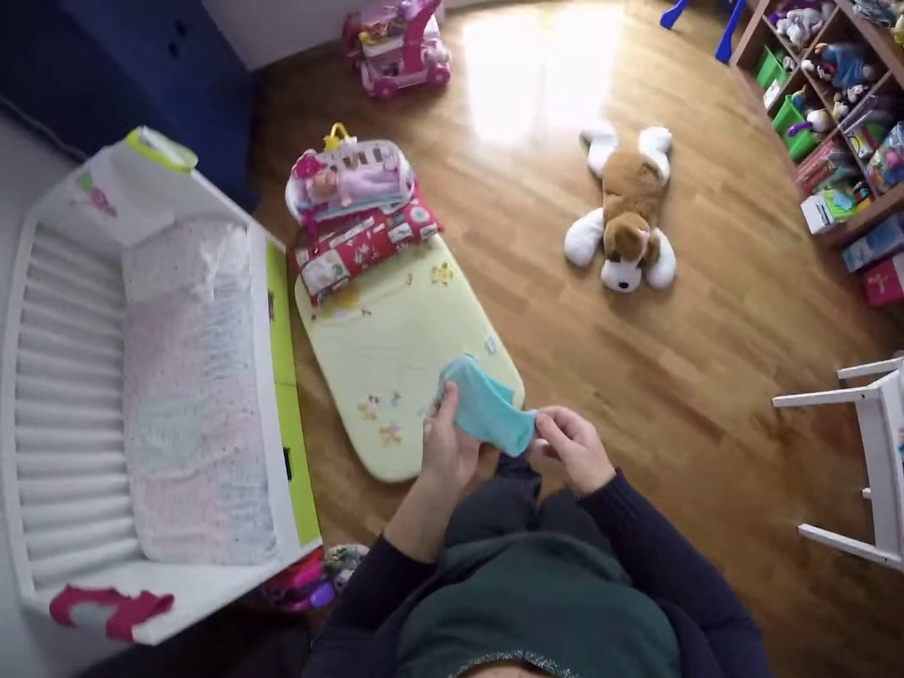 | 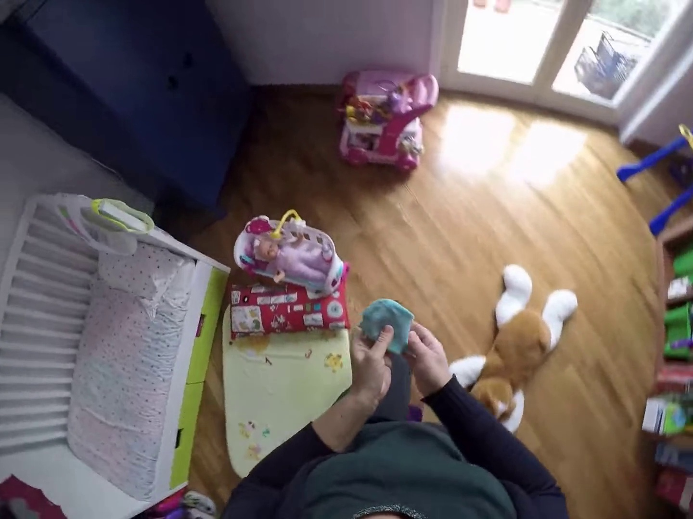 | 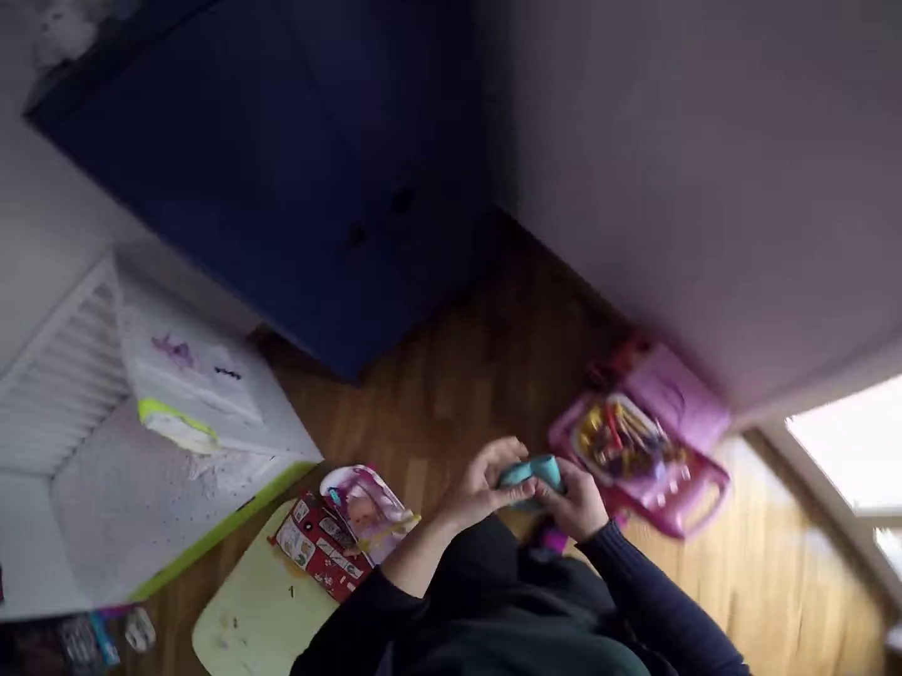 | 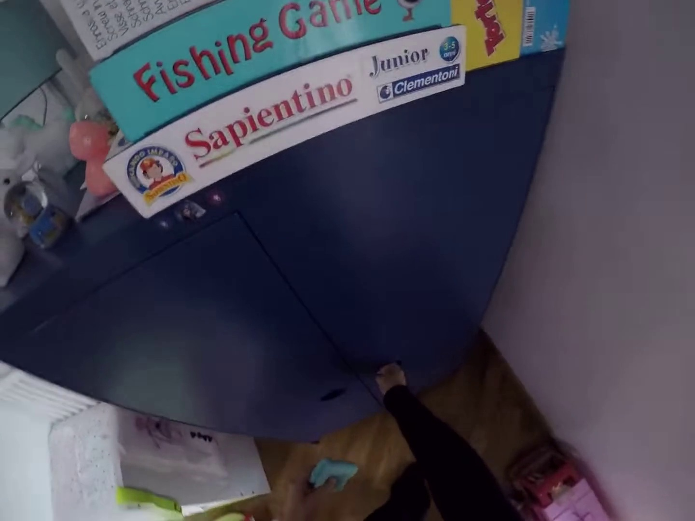 | 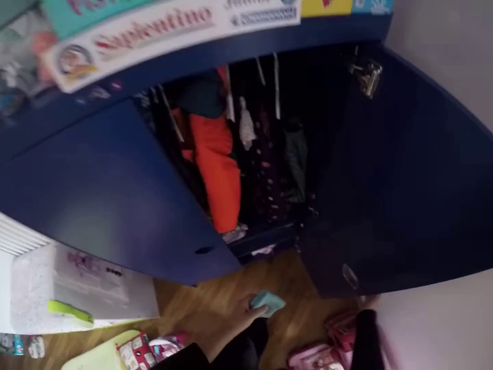 |

### Answer-time window

| 11s | 12s | 13s | 14s | 15s |
|---|---|---|---|---|
|  |  |  |  |  |

### Interleaved memory before answering

```xml
<delta>...folding baby clothes...</delta>
<delta>...placing a folded onesie into a drawer...</delta>
<anchor><image:dataset/ovo/video/1143/000015.jpg></anchor>
```

### Text-only memory before answering

```text
5.0-10.0:
The person folds the light pink baby onesie and places it inside the open drawer.

10.0-15.0:
The person is holding a light blue baby sock and is in the process of folding it...
```

### Outputs

Interleaved:

```xml
<state>
After folding a pink onesie and placing it in a drawer, they folded a blue onesie.
The current frame shows them opening a blue cabinet, presumably to put the blue onesie away.
</state>
<answer>B</answer>
```

Text-only:

```xml
<state>
The person is interacting with a blue cabinet, specifically opening one of its doors...
</state>
<answer>B</answer>
```

### Takeaway

这个短视频 case 展示的是细粒度 object-action chain。两边都能答对，但图文交错把关键动作绑定到少量 anchor 上。

---

## Case 9: `1480_0`, CRR, insufficient evidence

### Question

```text
The man picked up several books from the ground.
What does the man do with the books he picked up?
Decide whether the existing visual content provides enough information.
Answer only with "Yes" or "No".
```

### Result and Cost

| Method | Answer | Score | Memory tokens |
|---|---|---:|---:|
| Interleaved Memory | No | 1 | 8,055 |
| Text-only Memory | No | 1 | 42,903 |

Token saving:

```text
1 - 8,055 / 42,903 = 81.2%
```

### Evidence window

This is a rejection case. The visible evidence only shows picking up or stacking books, not a later outcome.

| 862s | 863s | 864s | 865s | 866s |
|---|---|---|---|---|
| 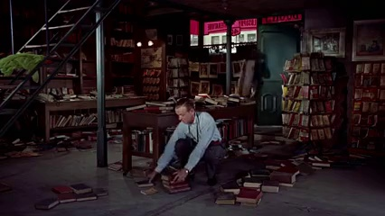 | 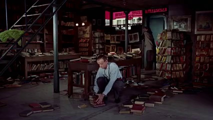 | 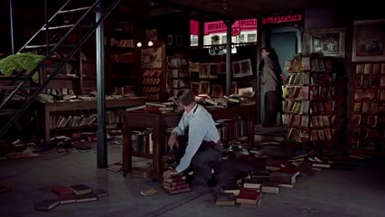 | 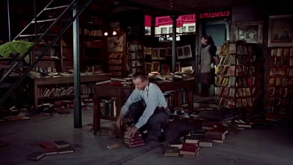 | 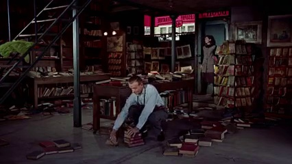 |

### Answer-time window

| 865s | 866s | 867s | 868s | 869s |
|---|---|---|---|---|
|  |  | 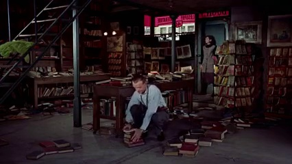 | 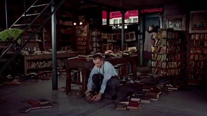 | 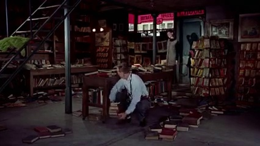 |

### Interleaved memory before answering

```xml
<delta t="856.0-862.0">...the woman turns and walks away...</delta>
<anchor t="862.0-863.0"><image:dataset/ovo/video/1480_0/000862.jpg></anchor>
<delta t="863.0-870.0">
The man in a blue shirt and vest continues to pick up books from the floor in the bookstore.
</delta>
```

### Text-only memory before answering

```text
860.0-865.0:
The scene transitions to the interior of the bookstore. A man is visible picking up books...

865.0-870.0:
The man is picking up books from the floor and stacking them.
```

### Outputs

Interleaved:

```xml
<state>
The current frames show the photographer continuing to stack books.
The question asks what the man does with the books he picked up.
The current frames do not show him doing anything with the stacks of books yet.
</state>
<answer>No</answer>
```

Text-only:

```xml
<state>
The current frames show him picking them up and stacking them,
but not what he does with them after picking them up.
</state>
<answer>No</answer>
```

### Takeaway

这个 case 展示图文交错 memory 也支持拒答。memory 里有前提动作，但没有后续结果，所以正确输出是 `No`。

---

## How to Read This Demo

1. 先看 **Evidence window**：答案证据是否真的在视频里出现。
2. 再看 **Answer-time window**：回答问题时当前帧是否还包含这个证据。
3. 对比 **Interleaved memory** 和 **Text-only memory**：前者用视觉 anchor 保留可回看的证据，后者只能靠文字展开。
4. 最后看 **Outputs**：判断正确或错误是否来自 memory 证据，而不是只看最后一帧。

如果要在论文中使用，建议把 Case 1、Case 2、Case 3 作为主例子：

- `636`：图文交错省 `86.8%` token，并修正纯文本的方向误判。
- `1474_2`：图文交错省 `86.8%` token，并正确判断 CRR 证据已出现。
- `199`：backward memory retrieval，图文交错省 `58.6%` token，并通过早期 anchor 答对。
